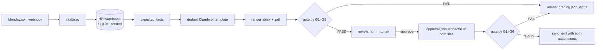

# verify-gate

[](https://github.com/jbisaccia-9/verify-gate/actions/workflows/ci.yml)

**Monday.com → HR warehouse → AI-drafted employment letters in Word and PDF — and the gate that refuses to email one until every fact traces to the warehouse and a human has signed the bytes.**

The workflow is ordinary: someone puts an employee ID on a Monday.com board and
asks for an employment verification letter or a background-check attestation.
The risk is ordinary too: an LLM that writes a beautiful letter with the wrong
hire date, a salary the employee never consented to release, a PDF that didn't
get regenerated after the .docx was edited, or an email that goes out because
a reviewer clicked "approve" on a version that was then changed. Every one of
those is a counterexample in this repo, and CI asserts that every one is
refused. On the current samples: **9/9 letters pass, 6/6 counterexamples are
refused — each for exactly the rule in its name.**

## Quickstart

```bash
pip install git+https://github.com/jbisaccia-9/verify-gate
python -m verifygate demo --drafter template                  # 9 packets, all PASS
python -m verifygate prepare samples/monday_webhook.json       # one request, gated
python -m verifygate send req-55b477a426 --dry-run             # FAILED: G6 no approval, exit 1
python -m verifygate approve req-55b477a426 --reviewer "Your Name"
python -m verifygate send req-55b477a426 --dry-run             # PASSED, writes sent.eml
python -m verifygate counterexamples out/cx && python -m verifygate check-dir out/cx   # exit 1
```

No credentials are needed for any of that. With `ANTHROPIC_API_KEY` set the
prose is drafted by Claude instead of the template; with `SMTP_HOST` set,
`send` actually sends. Both pass through the same gate. See `.env.example`.

## The split that makes the gate possible

**Facts are computed. Prose is generated.** `expected_facts(employee, request)`
derives, deterministically, the exact set of facts a given letter type may and
must state for a given record — hire date, title, status, end date if
terminated, salary only if the employee's release is on file. The drafter
writes paragraphs *around* those facts. The gate then grades the **rendered
text**, not the draft object: the draft is what the model claimed, the text is
what the recipient reads.

| rule | what it refuses |
|---|---|
| G1 identity | an employee ID that doesn't resolve to exactly one warehouse row |
| G2 facts | any stated fact that differs from the warehouse; any required fact missing from the text |
| G3 disclosure | SSN / DOB / home address anywhere; salary without consent; **any date or dollar amount the warehouse didn't supply** |
| G4 fidelity | a PDF whose text differs from the .docx it was supposedly printed from |
| G5 eligibility | an attestation for someone whose check isn't Cleared; a letter for a status the template can't state |
| G6 approval | sending without a human approval, or with one whose file hashes no longer match |

G3's last clause is the one that catches real hallucinations: a model that
adds "their last review was on January 4, 2026" has stated nothing false about
the warehouse facts, but it has stated a date the warehouse never supplied. The
gate doesn't need to know whether it's true. It isn't sourced, so it's refused.

## How it works



Every request lives in `out/packets/<request_id>/` with every stage left on
disk: the request, the draft, both documents, the verdict, the review sheet,
the approval, the email. An approval is not a checkbox — it is a signature
over the bytes of the two files, and `send` re-runs the whole gate plus G6
before anything leaves.

## The gate earned its keep on the first run

The first demo run **failed G2 on every verification letter**: the template
wrote "is currently a Full-time Senior Software Engineer" and never stated the
literal status word the warehouse holds (`Active`). The gate was right — a
letter that implies a status is not a letter that verifies one — so the
template now states "Employment status of record: Active" and the rule was
left alone. Then the address test failed: the leak detector only matched the
full `street, city, state zip` string, so a street line on its own slipped
through. It now matches the street line by itself. See
[RESULTS.md](RESULTS.md) for the captured run.

## The counterexamples

```
g1-unknown-employee          Monday item carries an ID the warehouse has never seen
g2-hallucinated-hire-date    draft echoes the right fact back but writes a different date into the prose
g3-salary-without-consent    requester asked for compensation; employee never signed the release
g4-stale-pdf                 .docx regenerated after an edit, PDF left as-is
g5-attestation-pending-check new hire whose background screen hasn't come back
g6-edited-after-approval     reviewer approved, then the files were re-rendered
```

Each is a real way this workflow fails, not a synthetic edge case. `check-dir`
on that directory must exit non-zero in CI, and each packet must fail on its
own rule — not on a pile of collateral rules that would make the label
meaningless.

## What's here

```
src/verifygate/
  intake.py           Monday.com webhook (challenge handshake + column map) → LetterRequest
  warehouse.py        SQLite HR warehouse seeded from samples/employees.json
  draft.py            expected_facts(), forbidden_values(), the Claude and template drafters
  render.py           one Draft → .docx (python-docx) and .pdf (reportlab); text read-back for the gate
  gate.py             G1–G6
  pipeline.py         packet lifecycle: prepare → approve → send
  counterexamples.py  the six packets that must be refused
  __main__.py         CLI, including `serve` — a stdlib webhook receiver for Monday
```

## Scope, stated honestly

- **Northlight Systems is fictional**, as are every employee, address, vendor,
  phone number, and email domain in the seed. The shape is real; the data is not.
- The warehouse is a seeded SQLite file. In production it's a read replica of
  your HRIS export; `Warehouse.lookup` is the one function to swap.
- The Claude drafter keeps non-conforming output as prose and flags
  `schema_violation: true` rather than discarding it — the gate refuses it for
  whatever it actually gets wrong, which is more useful than "parse error."
- Text extraction from the PDF is what the gate compares, so a PDF that embeds
  the letter as an image would pass G4 with an empty string. Don't do that.
- Approval is a local JSON record with hashes. It proves *what* was approved,
  not *who* clicked — identity is your SSO's job, not this repo's.

## Part of the *-gate* family

Nothing ships until it passes a gate — and the gate itself must be earned.
The others: [github.com/jbisaccia-9](https://github.com/jbisaccia-9).

MIT.
